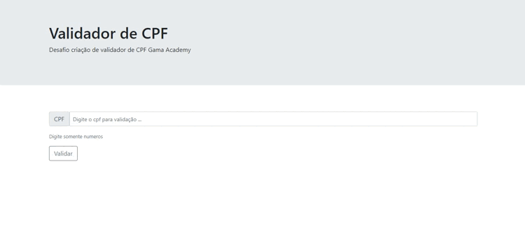

# Projeto validador de CPF

 Projeto destinado a criação de Validador de CPF. Atividade realizada pelo na plataforma Gama Academy - Hiring Coders .

 
 
 :test_tube: Proposta do projeto :nerd_face:

 
 
  

## :gear: Funcionalidades do projeto

- `Funcionalidade 1` `Receber o valor digitado no campo de CPF`: A primeira funcionalidade é receber os números de CPF no campo determinado
- `Funcionalidade 2` `Validar CPF no botão "Validar"`: A segunda funcionalidade é capturar o valor contido no campo e validar se o número do CPF é válido ou não mediante as regras de CPF regidas pela receita federal do Brasil.

## :computer: Tecnologias usadas

- ``HTML5``
- ``CSS3``
- ``Bootstrap``
- ``Javascript``

## :open_file_folder: O que acha de acessar o projeto? 
Você pode acessar o projeto clicando [aqui](https://oscarlojr.github.io/valida_cpf/).
